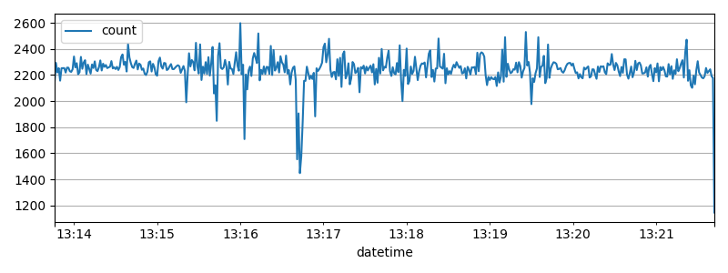
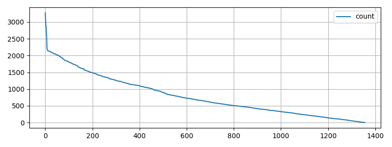
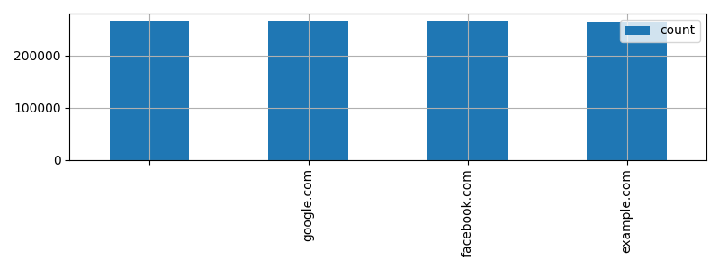
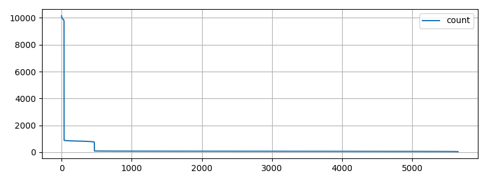
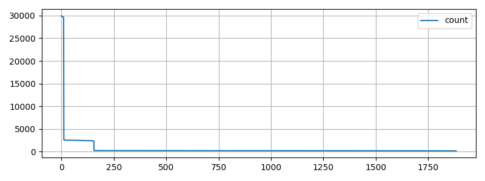
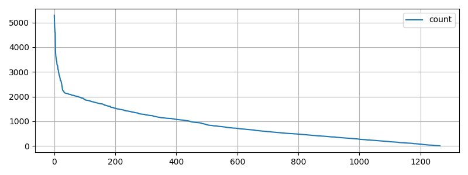
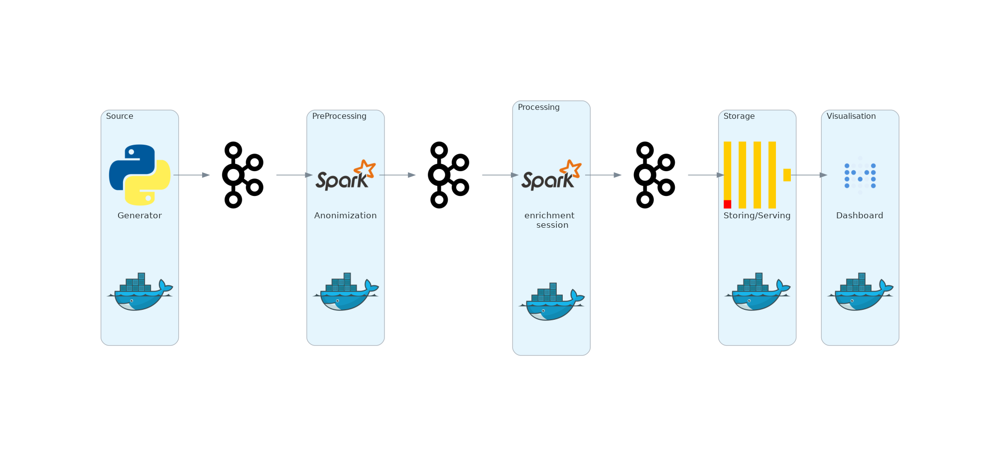

# 1. Kontekst biznesowy

Klientem jest informacyjny portal internetowy, którego głównym źródłem dochodu są reklamy pokazywane użytkownikom. Do tej pory główny reklamodawca rozliczał się z portalem na zasadzie ryczałtu, ustalonej kwoty przelewanej na konto klienta w miesięcznych interwałach. W ostatnim czasie odstąpił od takiego modelu finansowania swoich kampanii reklamowych na rzecz ustalonej kwoty za każde 1000 odsłon stron zawierającyh materiały reklamowe. Przy takim sposobie rozliczania klient stracił znaczną część swojego głównego źródła dochodu. **Głównym zadaniem jest zdefiniowanie co wpływa na poziom ruchu na stronie oraz jakie zadania należy wykonać aby zwiększyć liczbę odsłon**. Jak się okazało klient nie dysponuje żadnym dedykowanym do tego typu zadań działem analitycznym ani działem wyspecjalizowanym działem technicznym. Techniczne kwestie związane z serwowaniem treści zostały oddelegowane do zewnętrznego podmiotu, który nie oferuje usług w zakresie doradztwa analitycznego. 

Po konsultacjach z klientem oprócz głównego celu zdefiniowano również cel dodatkowy jakim jest przygotowanie testowego środowiska dla przyszłego działu analitycznego którego zadaniem będzie utrzymanie/zwiększenie efektywności dochodowej protalu. Środowisko te ma pozwalać na:

 - przechowywanie surowych danych (obecnie dane ze skryptów na stronie nie są przechowywane a jedynie agregowane ilościowo w kubełkach godzinnych co nie pozwala na inną niż ilościową analizę historycznych danych)
 - przetwarzanie danych w celu tworzenia cyklicznych, automatycznie powstających raportów
 - prezentację danych w formie tabel, wykresów oraz tablic agregujących różne wyniki (dashboard)
 - wykonywanie na surowych danych doraźnych, niestandardowych danych


Z założenia środowisko ma być testowe(aby w pierwszym okresie nie poświecać czasu na uprodukcyjnianie rozwiązania badawczego) ale użyte technologie powinny być:

 - łatwo skalowalne - klient zakłada w przyszłości wzrost generowanego ruchu
 - powszechnie używane w środowisku - co zapewnia dostęp do specjalistow znających daną technologię oraz potwierdza jej przydatność i możliwość zastosowania w realnych przypadkach 
 - w miare możliwości open source z rozwiniętą społecznością wokół technologii - podejście to nie generuje kosztów licencyjnych a jednocześnie pozwala na znalezienie rozwiązań wielu problemów w ogólnodostępnych tematycznych forach internetowych
 - modułowe - system podzielony na kilka mniejszych modułów jest łatwiejszy w zrozumieniu, utrzymaniu, rozwijaniu czy znajdowaniu błędów
 - integrowalne z wieloma rozwiazaniami - brak potrzeby manualnej integracji przy każdorazowej zmianie/dodaniu rozwiązania znacząco przyspiesze rozwój oraz zmniejsza ilość potencjalncyh błędów
 - zastępowalne - dzięki identycznym lub podobnym interfejsom w następnych fazach projektu będzie można zastąpić wybrane rozwiązanie innym o bardziej porządanych parametrach czy cechach bez przebudowywania dużej części systemu.


Klient zdaje sobie sprawę, że w pierwszym kroku analizy mogą nie przynieść oczekiwanych efektów jednocześnie jest świadomy tego, że aby przedsiębiorstwo mogło pracować w oparciu o dane należy zaszczepić w nim kulturę pracy z tymi danymi, a do tego niezbędne jest odpowiednie środowisko techniczne.


Dodatkowe wymaganie pochodzi z konsultacji klienta z wewnętrznym działem prawnym. Adres IP jest jedną z informacji przysyłanych przez skrypty umieszczone na stronie portalu. Adres ten w pewnych przypadkach może być uznawany za daną osobową.[^1] Dane osobowe muszą być specjalnie przechowywane co zwiększa potencjalne koszty oraz komplikuje system. W związku z tym podjęto decyzję o anonimizowaniu adresu IP w przechowywanych permanentnie danych.

[^1]:https://archiwum.giodo.gov.pl/pl/319/2258 


\pagebreak

# 2. Dostępne dane

Jak było wspomniane w poprzednim rozdziale surowe dane ze skryptów monitorujących ruch na portalu nie są nigdzie przechowywane. Jednak są one doskonałą bazą wykonania niezbędnych w realizacji celu analiz. Z danych agregowanych godzinowych (przekazanych przez obecną firmę obsługującą portal od strony technicznej serwowania treści) na temat aktywności użytkowników portalu można wywnioskować, że maksymalne zaobserwowane obciążenie godzinowe wynosi około 1 000 000 odsłon co daje średnią około 300 odsłon/sekundę. Na razie nie da się stwierdzić na ile maksymalne wartości sekundowe będą większe od wyliczonych średnich. 

# 2.1 Struktura
Poniżej przedstawiono listę dostępnych danych ze skryptów wraz z ich typem oraz przykładowymi wartościami:

 - time: timestamp(UTC) - 1654002960
 - cookieID: String - 42665723377567478468790510194422896337
 - userAgent: String - "Mozilla/5.0 (X11; Linux i686; rv:1.9.7.20) Gecko/2430-08-14 01:01:49 Firefox/13.0"
 - url: String - "example.com/category/main/tags?testVersion=a"
 - referer: String - "google.com"
 - ip: String - "60.21.16.140"

Poza kolumną time która jest typu timestamp reszta to kolumny tekstowe częściowo ustrukturyzowane

# 2.3 Statystyki

Podsumowanie na podstawie około jednego miliona testowych rekordów.

# 2.3.1 Zdarzenia w czasie.

Opis wykresu:

  - oś y - liczba zdarzeń
  - oś x - kolejne sekundy




# 2.3.2 Zdarzenia per Cookie.

Opis wykresu:

  - oś y - liczba zdarzeń
  - oś x - kolejne cookiesy, posortowane od najbardziej aktywnego




# 2.3.3 Zdarzenia per referer.

Opis wykresu:

  - oś y - liczba zdarzeń
  - oś x - kolejne odsyłacze




# 2.3.4 Zdarzenia per url.

Opis wykresów:

  - oś y - liczba zdarzeń
  - oś x - kolejne urle, posortowane od tego z największą liczbą zdarzeń





# 2.3.5 Zdarzenia per user agent.

Opis wykresu:

  - oś y - liczba zdarzeń
  - oś x - kolejne user agenty posortowane od najbardziej popularnego w ramach zdarzeń.




# 2.3.5 Zdarzenia per adres IP.
Odnotowano 1 068 649 unikalnych adresów IP na 1 068 807 zdarzeń. Co oznacza, że w zasadzie przy każdym zdarzeniu wygenerowany został nowy adres IP. To punkt do dalszej analizy, ponieważ jest to wysoce nie prawdopodobne, że  IP jest zmieniane co każde zdarzenie

# 2.3.6 Podsumowanie
Z powyższych testowych statystyk widać, że:

 - liczba zdarzeń jest względnie stała w czasie
 - cookiesy posiadają różną liczbę odsłon choć o podobnym rzędzie wielkości
 - referery podzielone są na 4 kategorie (brak , facebook.com, google.com , wewnetrzny) które są w zasadzie równoliczne.
 - liczba urli wynosi niecałe 6 000. Jednak nie usuwano z nich parametrów. Po usunięciu dodatkowych parametrów zostało niecałe 2000 unikalnych urli
 - liczba user agentów jest trochę mniejsza liczba cookiesów co oznacza, że tylko niewielka część się powtarza
 - liczba adresów IP do zbadania

Do analiz należy dane posegmentować na kilka zbiorów. Przy obecnym rozkładzie statystyk zdarzeń jedynym kandydatem do segmentowania są referery choć są one równoliczne (co może być przypadkiem testowych danych) i mogą być zbyt mało charakterystyczne. Wytypowano pole useragent jako to z którego można wydobyć dodatkowe bardziej ogólne informacje takie jak: typ urządzenia (PC, mobile itp), system operacyjny, rodzaj przeglądarki.  
 
# 2.4 Generator
Ponieważ nie udało się uzyskać realnych(zanonimizowanych) danych na temat ruchu portali internetowych zdecydowano na stworzenie modułu generującego takie dane w sposób losowy.[^2] Do tego zadania użyto biblioteki Faker[^3] oraz modułu random[^4] wbudowanego w język programowania Python.

W pierwszym kroku generowane są następujace zbiory:
 
 - parametrów do adresów url z przypisanymi parametrami 
 - refererów
 - par cookieID, userAgent (aby zapewnić niezmienialność stałe przypisanie)

Każdy element z wyżej wymienionych zbiorów ma przypisane prawdopodobieństwo losowania, przy czym w obecnym rozwiazaniu parametery oraz referery posiadają różne ale stałe wartości a każdy cookies ma przypisane losowe prawdopodobieństwo.

Poniżej fragmenty kodu odpowiedzialne za przygotowanie powyższych zbiorów 
```python3
def generateUniqueCookie(count=100):
    fake = Faker()
    return [fake.uuid4(cast_to=int) for _ in range(count)]


def generateUserAgent(count=100):
    fake = Faker()
    return [fake.user_agent() for _ in range(count)]


def getCookieUa(elemCount=10):
    cookies = generateUniqueCookie(elemCount)
    ua = generateUserAgent(elemCount)
    activityLevel = [random.random() for _ in range(elemCount)]
    cookie_ua_elements = [(x, y, z) for x, y, z in zip(cookies, ua, activityLevel)]
    return cookie_ua_elements

.....

urlParamsOptions = OrderedDict([("", 0.8), ("?testVersion=a", 0.10), ("?testVersion=b", 0.10), ])
refOptions = OrderedDict([("", 0.3), ("facebook.com", 0.10), ("google.com", 0.10), (domain, 0.50)])

urlParams = fake.random_element(elements=urlParamsOptions)
"referer": fake.random_element(elements=refOptions),
                        

```

W drugim kroku generowane są zbiory testowych danych zdarzeń w nieskończonej pętli. Po każdym wylosowaniu cookiesa sprawdzamy czy przypisane do niego prawdopodobieństwo bycia aktywnym jest większe od losowej wartości z przedziału 0-1. Dzięki temu w sposób losowy różnicowany jest rozkład aktywności poszczególnych cookiesów oraz liczba zdarzeń nie jest identyczna dla każdej sekundy. Podczas generowania pojdyńczego zdarzenia sprawdzane jest również czy nie należy wykonać rotacji cookiesów (na podstawie wejściowego parametru obecnie ustawionego tak aby średnio raz na 5 minut następowała rotacja zbiorów). Do wykonania opisanej rotacji rozszerzono wbudowaną klasę DynamiProvider biblioteki Faker o nową metodą "replace_random_elements". Takie podejście zapewnia czytelny kod oraz możliwość zmiany logiki zmiany przygotowanej metody bez wpływu na główny kod generatora. 

```python3
class CookieUaProvider(DynamicProvider):
    def __init__(self, provider_name, elements=None, generator=None, initElemCount=10):
        super().__init__(provider_name, elements, generator)

        if elements is None:
            allElements = getCookieUa(elemCount=initElemCount * 10)
            self.elements = self.random_sample(elements=allElements, length=initElemCount)

        else:
            assert len(elements) > 0
            allElements = None
            self.elements = elements

        self.allElements = allElements

    def replace_random_elements(self, replaceRate=0.2):
        assert replaceRate < 1
        assert replaceRate > 0

        currentCount = len(self.elements)

        length = int((1 - replaceRate) * currentCount)
        notRemovedElements = self.random_sample(elements=self.elements, length=length)

        newCount = currentCount - length
        newElements = self.random_sample(elements=self.allElements, length=newCount)

        self.elements = notRemovedElements + newElements  # elems are initilized in super class
        print("replacedCookies")
```

[^2]:https://github.com/gonti89/bigDataProject/blob/main/generator/2.0/internet_generator.py
[^3]:https://faker.readthedocs.io/en/master
[^4]:https://docs.python.org/3/library/random.html


\pagebreak

# 3. Rozwiązanie koncepcyjne problemu biznsowego
Jak było wymienione we wstępie głównym zadaniem jest zdefiniowanie co wpływa na poziom ruchu na stronie oraz jakie zadania należy wykonać aby zwiększyć liczbę odsłon. Po wstępnej analizie testowego sampla danych widać, że liczba odsłon jest powiązana z dwoma aspektami:

 - liczbą użytkowników (więcej użytkowników więcej odsłon)
 - średnią liczbą odsłon wykonanych przez użytkownika.

Można przeformułować powyższe punkty na następujące cele:

 - (1) zwiększenie liczby nowych użytkowników korzystających z portalu
 - (2) zwiększenie zaangażowania użytkowników już obecnych na portalu

Do próby zrealizaowania powyższych celów podjęto decyzję o przygotowaniu następującyh danych:

 - % udziału poszczególnych źródeł ruchu (1) - pomoże to odpowiedzieć na pytanie ile % które źródło ruchu generuje użytkowników. To z kolei wskaże klientowi, w które kanały warto inwestować pod względem reklamowym
 - segmentacja obecnych użytkowników ze względu na typ używanych urzadzeń (1) - pomoże to odpowiedzieć na pytanie czy są jakieś grupy użytkowników szczególnie zainteresowane treścią portalu lub czy któregoś segmentu popularnego w populacji internautów brakuje na stronie
 - rozkład sesji oraz czasu spędzonego na portalu przez obecnych użytkowników (2) - pomoże to odpowiedzieć na pytanie jak użytkownicy korzystają z portalu i czy można w jakiś sposób zachęcić ich do dłuższego kontatku ze stroną
 - ranking top 10 stron z największą liczbą odsłon (2) - wskaże to klientowi informację jakie treści generują dużo zdarzeń.

Dane te powinny być dostępne w postaci dashboardu, który będzie się aktualizował w czasie prawie rzeczywistym. Takie podejście pozwoli monitorować obecną sytuację oraz w razie zmian na portalu na bierząco obserwować zmiany.


\pagebreak

# 4. Model danych

Aby przygotować potrzebne podsumowania należy z surowego zestawu danych stworzyć nowy zestaw danych. Po pierwsze należy zanonimizować adres IP. Wybrano opcje usunięcia ostatnio oktetu. Aby nie tracić kompletenie informacji na temat cech poszczególnych IP postanowiono wykonać hash  z tego pola, tak aby nowa wartość nie pozwalała na potencjalne użytkowników ale jednocześnie zachowywała różnorodność danych źródłowych. Po drugie postanowiono wzbogacić każde zdarzenie o dodatkowe informacje pochodzące z user agenta: system operacyjny, typ urządzenia, rodzaj przeglądarki. Informacje te pozwolą na wykonanie dodatkowych segmentacji. Po trzecie na podstawie zdarzeń postanowiono zbudować sesje użytkowników. Sesje, czy też inaczej nazywane wizyty, to ciąg odsłon wykonanych przez danego użytkownika na danej domenie nie wiekszą przerwą niż pewien zdefiniowany czas pomiędzy kolejnymi odsłonami. Wg definicji[^5] firmy analitycznej google.com przerwa ta jest nie większa niż 30 minut. Po konsultacjach z klientem uznano jednak, że na potrzeby analiz przyjęta zostanie przerwa wynosząca 5 minut.

Z surowych danych:

|time   |cookieID|userAgent|url   |referer|ip    | 
|-------|--------|---------|------|-------|------|
|INTEGER|STRING  | STRING  |STRING|STRING |STRING|


Zostaną utworzone dwie tabele:
 
 - tabela zdarzeń wzbogacone o nowe dodatkowe informacje

|time   |cookieID|userAgent|url   |referer|ipHash |shortIP |deviceType|os    |browser| 
|-------|--------|---------|------|-------|-------|--------|----------|------|-------|
|INTEGER|INTEGER  | STRING  |STRING|STRING |INTEGER|STRING  |STRING    |STRING|STRING |

 - oraz tabela sesji

|cookieID|deviceType|os    |browser|start|end|duration|uniqueUrlCount| 
|--------|----------|------|-------|------------|----------|---------------|---------------------|
|INTEGER | STRING   |STRING|STRING |INTEGER     |INTEGER   |INTEGER        |INTEGER              |

Tabele są niezależne, mimo iż teoretycznie za pomocą pola cookieID możliwe byłoby łączenie.


[^5]:https://support.google.com/analytics/answer/2731565?hl=en#overview&zippy=%2Cin-this-article

\pagebreak

# 5. Opis modułow

Aby wykonać cel dodatkowy zaprojektowano i wykonano system do przetwarzania danych, który stara się spełnić wymienione wcześniej cechy:
 - skalowaność
 - powszechność stosowania 
 - otwartoźródłowy 
 - modułowość
 - łatwo integrowalne
 - zastępowalne

Każdy moduł systemu działa w oddzielnie stworzonym kontenerze za pomocą technologii Docker i jest na etapie testowym zarządzane za pomocą narzędzia Docker Compose. Dzięki takiemu podejściu bardzo łatwo skalować to rozwiązanie oraz przenosić pomiędzy różnymi środowiskami wykonawczymi. W sytemie zastosowano następujące technologie:

 - język programowania Python
 - silnik ogólne przetwarzani Spark
 - system kolejkowania w systemie publish/subscribe Kafka
 - silnik bazodanowy Clickhouse
 - narzędzie do wizualizacji Metabase

Wszystkie wymienione wyżej technologie spełniają wymienione wcześniej cechy.

## 5.1 Ogólny schemat rozwiązania
Logiczny podział funkcji systemu został przedstawiony na poniższym schemacie. 



Jest to system przetwarzający dane w sposób ciągły. Surowe zdarzenia trafiąją do brokera wiadomości skąd mogą być konsumowane przez klienta (jeden lub kilka działów). Rekomendowane jest jednak używanie danych po etapie preprocessingu w ramach którego anonimizowany jest adres IP. W takim podejściu każdy zespół konsumujący te dane nie musi implementować tej funkcjonalności po swojej stronie ( co oprócz dodatkowej pracy mogło by powodować niejednozność danych - inny sposób anonimizacji). Po tym kroku dane kierowane są ponownie do brokera skąd konsumowane i przetwarzane są przez pierwszy moduł, którego zadaniem jest wzbogacenie danych i zbudowanie danych o sesjach użytkowników. Nastepnie dane kierowane są do kolejki wiadomości skąd konsumuje je bezpośrodnio silnik bazodanowy. Z bazy dane są wczytywane do systemu wizualizacyjnego.

W trzech miejscach systemu zastosowano broker wiadomości, który jest bardzo ważną częścią systemu w kontekście skalowalności, integrowalności czy rozszerzalności. Dodatkowo pełni funkcję dodatkowej kopii danych czy bufora w momencie awarii/podmiany jednego z modułów. Warto podkreślić, że stosując Python, Kafkę, Spark, ClickHouse nie bylo potrzeby stworzenia specjalnych integratorów między tymi narzędzami. Były one zaplanowane i udostępnione przez twórców tych rozwiązań. Jedynym wyjątkiem mógł być moduł do wizualicji Metabase, do którego nie było zaimplementowanej integracji z ClickHouse przez twórców. Jednak potrzebny element integracyjny został stworzony przez społeczność zgromadzoną wokół tych rozwiązań i udostępniony domyślnie w ramach Metabase.

Dokładniejsze omówienie poszczególnych modułów można znaleźć w kolejnych podrozdziałach. 

## 5.2 Preprocessing

Jak było już wcześniej wspomniane etap preprocessingu służy do obsługi procesu anonimizacji adresu IP poprzez zredukowanie tego adresu o wartość ostatniego oktetu. Dodatkowo zdecydowano się na wyliczenie hash z adresu IP tak zachować cechę jego różnorodności bezpośrednio nie przechowując wartości. Dzięki możliwościom wbudowanym w Spark akcje te można wykonać za pomocą odpowiednich wywołań w wysokopoziomowym API. Cała logika zawiera się w trzech linijkach.

```python
.withColumn('ipHash', F.hash("ip"))
.withColumn('splitIp', F.split("ip", "\."))
.withColumn('shortIp', F.concat_ws(".", F.slice("splitIp", start=1, length=3)))
```

Istniała możliwość aby etap preprocessingu i processingu połączyć w jeden moduł jednak nie zdecydowano się na ten krok z powodów:
 
- taki podział lepiej odwzorowuje logiczny ciąg przetwarzania zdarzeń
- dane po preprocessingu są rekomendowanym punktem wejściowym dla całej firmy. Jeżeli zajdzie potrzeba dodatkowych poprawek danych wejściowych ( na potrzeby innego zespołu) to zmiany należało by wykonać w module cześciowo przetwarzającym dane dla obecnego zespołu. Rodziło by to niepożądane uzależnienie danych.
- gdy zajdzie potrzeba bardziej złożonego przetwarzania właściwego będzie można te dwie części skalować niezależnie

## 5.3 Processing

W ramach tego modułu wzbogacane są dane o odsłonach użytkowników o dodatkowe informacje (1) oraz budowane są wizyty i liczony jest czas(2) na podstawie tych zdarzeń.

Do zbudowania tego modułu również użyto Spark. Jednak do uzyskania dodatkowych informacji na podstawie user agenta (1) potrzebne było rozszerzenie możliwości Sparka o specjalnie zdefiniowaną funkcję przetwarzającą dane tzw. UDF (User Defined Functions) oraz moduł user_agents. Dla przykładu z ciągu znaków nazywanego user agent "'Mozilla/5.0 (iPhone; CPU iPhone OS 5_1 like Mac OS X) AppleWebKit/534.46 (KHTML, like Gecko) Version/5.1 Mobile/9B179 Safari/7534.48.3'" za pomocą tego modułu można odczytać szereg informacji:

 - rodzina przeglądari (Mobile Safari)
 - wersja przegladarki (5.1)
 - system operacyjny (iOS)
 - i wiele innych.

Poniżej główne części kodu realizujące to zadanie.

```python
from user_agents import parse

@F.udf(returnType=StructType(
    [
        StructField("deviceType", StringType()),
        StructField("os", StringType()),
        StructField("browser", StringType()),
    ]))
def parseUserAgent(ua_string):
    if ua_string is None:
        ua_string = ""

    parsed_string = parse(ua_string)

    if parsed_string.is_pc:
        deviceType = "pc"
    elif parsed_string.is_mobile:
        deviceType = "mobile"
    elif parsed_string.is_tablet:
        deviceType = "tablet"
    else:
        deviceType = "other"

    output = {
        "deviceType": deviceType,
        "os": parsed_string.os.family,
        "browser": parsed_string.browser.family
    }
    return output

....
 .withColumn('parsedUa', parseUserAgent("userAgent"))
....
```

Tego typu funkcje są bardzo wygodne w stosowaniu, jednak obarczone są dodatkowymi kosztami w trakcie przetwarzania danych. Po pierwsze w ramach workerów Spark muszą zostać powołane do życia procesu pythonowe, po drugie ważniejsze dochodzi narzut czasowy związany z serializacją i deserializacją danych pomiędzy procesami pythona i wirtualną maszyną Java. Gdyby pojawiły się problemy wydajnościowo należaloby rozpatrzeć napisanie i udostępnienie podobnej funkcji w języku Scala lub Java (co eliminuje koszty wymienione przy funkcjach napisanych w Python).

Drugim zadaniem tego modułu jest wyznacznie sesji użytkowników. W Spark od wersji 3.2 jest specjalna wersja funkcji okiennej sesyjnej, która udostępnia specjalny typ okna czasowego w ramach którego można zdefiniować jak duża przerwa może być pomiędzy kolejnymi zdarzeniami aby utrzymać daną sesję dłużej. Do realizacji tego punktu potrzebne jest 9 linijek kodu, które realizuje następujące funkcje (jeden punkt to jedna linika z kodu poniżej):
 
 - usuwamy z adresu url informację o parametrach, które są dynamicznie dodawane w ramach konsumpcji danej strony. Ten punkt ma na celu nie zawyżać liczby unikalnych urli w ramach wizyty, który będzie realizowany w następnych punktach 
 - ustwiamy znak wodny na jedną minutę, przez co nie przetwarzamy zdarzeń do budowy sesji, które przyszły do systemu z opóźnieniem większym niż 1 minuta. Na potrzeby zdefiniowanych wcześniej anliz nie jest to kluczowe aby dokładnie każde zdarzenie uczestniczyło w budowaniu sesji.
 - grupujemy pod 4 polach (aby zachować je w późniejszej analizie) oraz definiujemy jak ma być budowane okno (na podstawie kolumny "time", z odstępem między zdarzeniami nie większym niż wartość zmiennej windowSessionTime - obecnie 5 minut)
 - agregujemy liczbę odsłon, oraz uniklanych urli odwiedzaonych w ramach wizyty
 - generujemy informację o początku sesji
 - generujemy informacje o końcu sesji
 - liczymy czas trwania sesji - spark domyślnie z koniec sesji uznaje ostatani timestamp zdarzenia w sesji + czas maksymalnego odstępu między zdarzeniami. Ten dodatkowy czas po ostatnim zdrzeniu jest w obecnym rozwiązniu usuwany (nie ma jak przy obecnych danych zdefiniować kiedy dokładnie zakończyła się sesja)
 - liczymy liczbę unikalnych urli (inaczej odwiedzonych węzłów)  

```python
.withColumn("urlNoParams", F.regexp_extract('url', r'[^?]*', 0))
.withWatermark("time", "1 minute")
.groupBy("cookieID", "deviceType", "os", "browser", F.session_window("time", windowSessionTime))
.agg(F.count("*").alias('events'),
     F.collect_set("urlNoParams").alias("uniqueUrls"))
.withColumn("sessionStart", F.col("session_window").start.cast("int"))
.withColumn("sessionEnd", F.col("session_window").end.cast("int"))
.withColumn("sessionDuration", F.col("sessionEnd") - F.col("sessionStart") - F.lit(windowPeriodSeconds))
.withColumn("sessionUniqueUrlsCount", F.size("uniqueUrls"))

```

Wszystkie transformacje powyżej, używają wysokopoziomowego Api DataFrame dzięki czemu jest możliwie maksymalnie wydajne rozwiązanie. Przykład ten doskonale unaocznia jak szerokie możliwości ma domyślne Api Spark  - obsługa wyrażeń regularnych, sesji okiennych, znaków wodnych, agregacji etc. 


## 5.4 Storage


## 5.5 Wizualizacja

\pagebreak

# 6. Napotkane problemy oraz ich rozwiązanie

\pagebreak

# 7. Możliwe drogi rozwoju systemu

\pagebreak


# 8. Wnioski

\pagebreak

# 9. Bibliografia
 - https://altinity.com/blog/2020/5/21/clickhouse-kafka-engine-tutorial – virtual columns
 - https://hub.docker.com/r/clickhouse/clickhouse-server/ - clickhouse docker
 - https://github.com/enqueue/metabase-clickhouse-driver – metabase clickhouse community driver
 - https://clickhouse.com/docs/en/integrations/kafka/kafka-table-engine/ 
 - https://www.metabase.com/docs/latest/operations-guide/running-metabase-on-docker.html
 - https://www.metabase.com/docs/latest/administration-guide/01-managing-databases.html#database-sync-and-analysis
 - https://vincent.doba.fr/posts/20211004_spark_data_description_language_for_defining_spark_schema/
 - https://towardsdatascience.com/spark-3-2-session-windowing-feature-for-streaming-data-e404d92e267
 - https://pypi.org/project/user-agents/
 - https://databricks-prod-cloudfront.cloud.databricks.com/public/4027ec902e239c93eaaa8714f173bcfc/968100988546031/1656753038112086/8836542754149149/latest.html
 - https://stackoverflow.com/questions/70991571/stream-data-from-one-kafka-topic-to-another-using-pyspark
 - https://stackoverflow.com/questions/2013124/regex-matching-up-to-the-first-occurrence-of-a-character
 - https://spark.apache.org/docs/latest/structured-streaming-programming-guide.html#window-operations-on-event-time
 - https://github.com/ykursadkaya/pyspark-Docker/blob/master/Dockerfile
 - https://stackoverflow.com/questions/37132559/add-jar-files-to-a-spark-job-spark-submit
 - https://stackoverflow.com/questions/50217212/how-do-i-write-to-kafka-using-pyspark
 - https://faker.readthedocs.io/en/master/
 - https://github.com/joke2k/faker 
 - https://docs.docker.com/develop/develop-images/dockerfile_best-practices/ - multiline env
 - https://support.google.com/analytics/answer/2731565?hl=en#overview&zippy=%2Cin-this-article – definition of visits
 - https://www.markdownguide.org/extended-syntax
